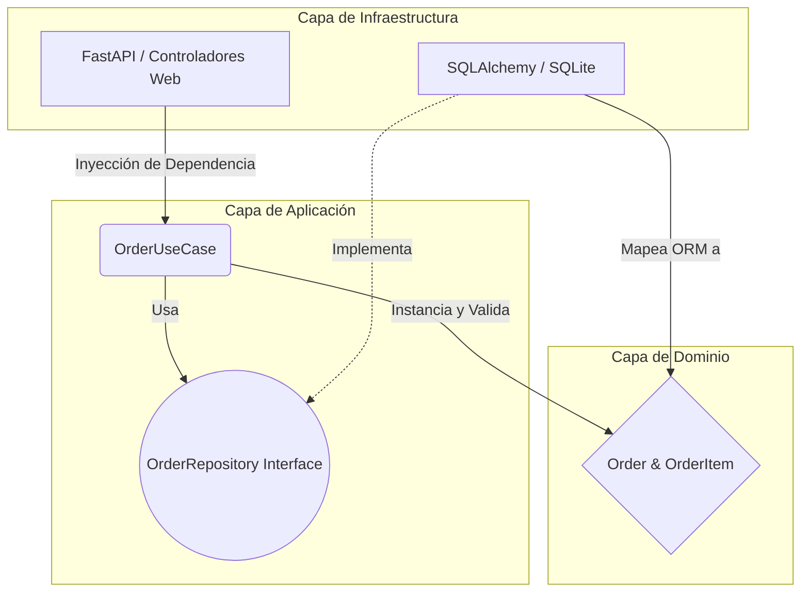

# Cap-Python-Proyecto-Integrador
Proyecto final del Curso de Python Axity 2026

## Descripción

API RESTful transaccional para órdenes de compra(CRUD) aplicando la **Arquitectura Hexagonal (Puertos y Adaptadores)**, y prácticas de DevSecOps (CI/CD, Hardening de Contenedores y Auditoría de Seguridad).

## Diagrama de Arquitectura

Se aísla la lógica de negocio del framework web y la base de datos, garantizando alta mantenibilidad y testabilidad.



## Estructura del proyecto
```text
.
├── alembic/                # Scripts de migración de base de datos
├── app/
│   ├── domain/             # Entidades puras y reglas de negocio
│   ├── application/        # Casos de uso y Puertos (Interfaces)
│   ├── infrastructure/     # Implementación de BD, ORM, Seguridad (JWT) y Web
│   ├── schemas.py          # DTOs (Pydantic) para entrada/salida de la API
│   └── main.py             # Entrypoint y Endpoints de FastAPI
├── tests/
│   ├── unit/               # Pruebas de Dominio y Aplicación (con Mocks)
│   ├── contract/           # Pruebas del Repositorio con BD real en memoria
│   └── e2e/                # Pruebas End-to-End simulando peticiones HTTP
├── Dockerfile              # Construcción Multistage y Endurecida (Hardened)
├── docker-compose.yml      # Orquestación de contenedores
└── pyproject.toml          # Gestión de dependencias y configuración de Linters
```

## Calidad de Código y Seguridad (CI/CD)
El repositorio tiene un pipeline automatizado en GitHub Actions que valida:
- Cobertura de Pruebas: 100% de cobertura en la capa de negocio evaluada con pytest.
- Linter y Formato: Ruff (ruff check y ruff format).
- Tipado Estático: Mypy estricto.
- Seguridad de Dependencias: Auditoría de vulnerabilidades con pip-audit.
- Hardening: El contenedor Docker se ejecuta mediante un usuario sin privilegios (appuser), aislando el entorno de ataques de escalamiento.

## Como ejecutar el proyecto

1. Copia el repositorio haciendo uso del siguiente comando: **git clone** seguido
de la URL del repositorio, el cual puedes encontrar en la sección de Code.
2. Ubica el archivo .env.example y cambia el nombre a .env
3. Asegúrate de que el archivo .env contenga los valores para DATABASE_URL y JWT_SECRET_KEY
4. Se requiere Docker instalado:
    - Asegurate estar en la raíz del proyecto (/Cap-Python-Proyecto-Integrador).
    - Revisa que el .env (renombrado anteriormente), se encuentre en la raíz del proyecto.
    - Construye y levanta el contenedor en segundo plano usando el comando:
    **docker-compose up -d --build**
    - Revisa en el programa de Docker Desktop que el contenedor este corriendo correctamente
    el contenedor ubica el nombre **cap-python-proyecto-integrador** despliega
    y veras el nombre **proyecto-orders-api**
    - La API estará disponible en: http://localhost:8000/docs
    - Para ver los logs puedes usar le programa Docker Desktop dando click
    en los 3 botones ubicados en la parte derecha del nombre **proyecto-orders-api** ,
    o bien, usar el comando: **docker-compose logs -f** para salir de los logs usa Ctrl+C.
    - Para apagar el proyecto usar **docker-compose stop** o bien borrar **docker-compose down**

## Prueba la API
1. La API estará disponible en http://localhost:8000/docs
2. Para iteractuar debes autenticarte:
    **Username** : admin
    **Password** : secreto
3. Una vez autenticado puedes probar la API usando estos ejemplos:
    - Crea una orden de manera correcta cumpliendo todas las reglas de negocio.
    ```text
    {
        "customer_email": "cliente@empresa.com",
        "items": [
            {
            "product_name": "Laptop Pro 15",
            "price": 1250.00,
            "quantity": 1
            },
            {
            "product_name": "Mouse Inalámbrico",
            "price": 25.50,
            "quantity": 2
            }
        ]
    }
    ```
    - Crea una orden con una lista de artículos vacía.
    ```text
    {
        "customer_email": "test@example.com",
        "items": []
    }
    ```

    - Crea una orden con un email inválido
    ```text
    {
        "customer_email": "correo_sin_formato",
        "items": [
            {
            "product_name": "Teclado",
            "price": 45.0,
            "quantity": 1
            }
        ]
    }
    ```

    - Para probar **PATCH /orders/{order_id}/status** solo basta con poner la ID
    del pedido que deseas actualizar (PAGADO, ENVIADO, CANCELADO).
    ```text
    {
        "status": "PAGADO"
    }
    ```

    Puedes probar con un tipo de status inválido para ver como reacciona la API
    al igual que poner un ID que no existe

    - Para probar **DELETE /orders/{order_id}** solo basta con poner la ID
    del pedido que deseas actualizar.
    Puedes probar con un un ID que no existe para ver como reacciona la API.
